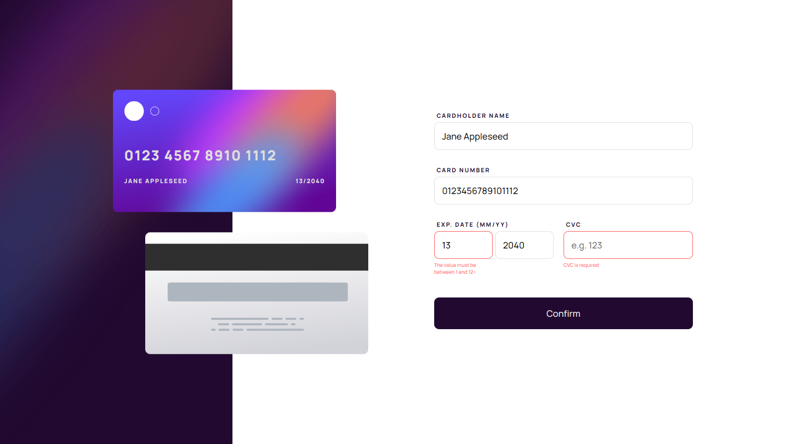
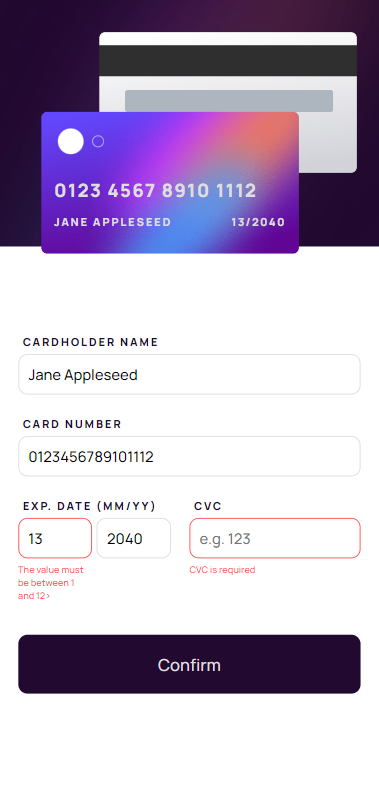

# Frontend Mentor - Advice generator app solution

Solution to the [Interactive card details challenge on Frontend Mentor](https://www.frontendmentor.io/challenges/interactive-card-details-form-XpS8cKZDWw)

### Screenshot

 

### Links

- Live Site URL: [https://interactive-card-frontendmentor.netlify.app](https://interactive-card-frontendmentor.netlify.app)

### Built with

- Vue3
- Vuelidate
- SCSS
- Mobile-first workflow
- Bootstrap breakpoints

## Author

- Author Name - Jakub Grzymisławski
